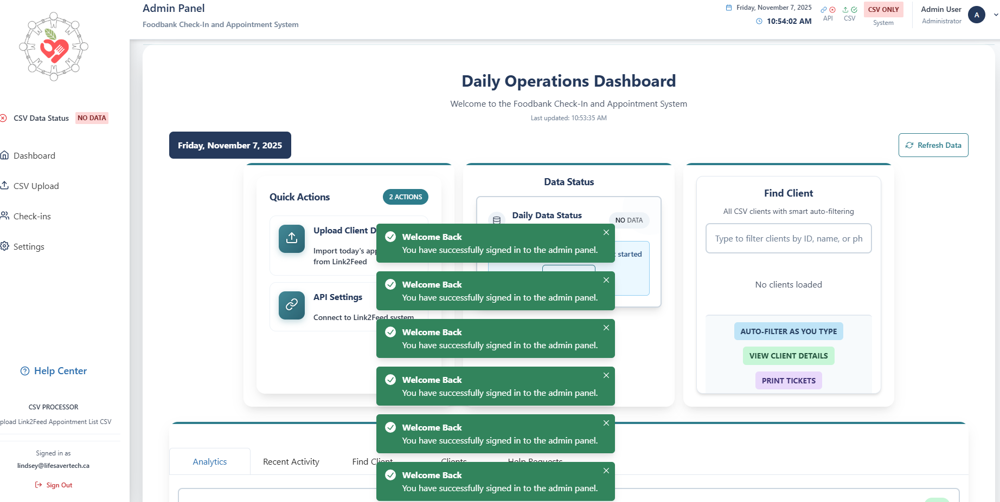

# 🍎 Foodbank Check-In and Appointment System

> **Originally designed as a capstone project at Thompson Rivers University (TRU), this system evolved into a production-ready application serving real food bank operations across Canada.**

🌐 **Live System**: [https://foodbank-checkin-tan.vercel.app/](https://foodbank-checkin-tan.vercel.app/) (Client Check-In) | [https://foodbank-checkin.vercel.app/login](https://foodbank-checkin.vercel.app/login) (Admin Dashboard)

[](https://www.typescriptlang.org/)
[](https://reactjs.org/)
[](https://vercel.com)
[](LICENSE)

**A production-ready frontend system for food bank operations, transforming client check-in workflow from paper-based to digital efficiency.**

🌐 **Live Client Check-In**: [https://foodbank-checkin-tan.vercel.app/](https://foodbank-checkin-tan.vercel.app/)  
📊 **Admin Dashboard**: [https://foodbank-checkin.vercel.app/login](https://foodbank-checkin.vercel.app/login)

> **📝 Portfolio Project**: This repository contains the **frontend applications** (Client App + Admin Dashboard) originally designed as a capstone project at Thompson Rivers University (TRU). The system evolved from academic research into a production-ready application serving real food bank operations. The backend API is not included in this repository.

---

## 🚀 Quick Start

This repository contains the **frontend applications** for the Foodbank Check-In System:

1. **Client App** (`/client`) - React/TypeScript frontend for client check-in (7,515 lines)
2. **Admin Panel** (`/admin`) - React/TypeScript frontend for staff management (14,113 lines)

**Frontend Tech Stack:** React 18, TypeScript, Chakra UI, React Router, i18next, Vercel

**📄 Sample CSV File:** See [`docs/sample-appointments.csv`](docs/sample-appointments.csv) for an example CSV file format compatible with Link2Feed exports. All data is sanitized/anonymized for demonstration purposes.

**⚠️ Note:** The sample CSV contains hardcoded dates (`2025-04-14`). To test the system, you must update all `Pick Up Date` values to match **today's date** before uploading. The system only allows check-ins for appointments scheduled for today.

---

## 🎮 Try It Out

**Live Demo Available:**
- **Client Check-In**: [https://foodbank-checkin-tan.vercel.app/](https://foodbank-checkin-tan.vercel.app/)
- **Admin Dashboard**: [https://foodbank-checkin.vercel.app/login](https://foodbank-checkin.vercel.app/login)
  - **Test Admin Credentials for Supabase Authentication:**
    - Email: `admin@example.com`
    - Password: `testing123`
  - Note: This is a test account for portfolio review and demonstration purposes

**⚠️ Important: Testing the System**
To test the complete check-in flow, you'll need:
1. **Download the sample CSV file**: [`docs/sample-appointments.csv`](docs/sample-appointments.csv)
2. **Update the dates**: Change all `Pick Up Date` values to match **today's date** (format: `YYYY-MM-DD @ HH:MM AM/PM`)
   - Example: If today is November 7, 2025, change `2025-04-14 @ 9:00 AM` to `2025-11-07 @ 9:00 AM`
   - The system validates check-ins based on today's date, so appointments must be for today to populate the check-ins for that day and it must be during the correct hours for the system validation work 
3. **Upload to Admin Dashboard**: Log in to the admin dashboard and upload the updated CSV file
4. **Test Client Check-In**: Use the phone numbers and last names from the CSV to test the client check-in flow

---

## 🌟 What Makes This Special

- ✨ **Real-World Impact**: Production-ready system designed for food bank operations
- 🌍 **Multi-Language Support**: 7 languages (English, French, Spanish, Chinese, Hindi, Arabic, Punjabi)
- 📱 **Mobile-First**: Works seamlessly on phones, tablets, and kiosks
- 🔒 **Privacy by Design**: All data auto-purges after 24 hours
- 🏢 **Multi-Location**: Scalable architecture supporting multiple food bank locations
- ⚡ **Fast Check-In**: Typically under 5 minutes (vs ~15 minutes with paper)
- 🎨 **Accessible**: WCAG-compliant design for screen readers and keyboard navigation

---

## 📸 Screenshots

### Client Application

#### Welcome & Language Selection

*Welcome page with language selection - clients can choose from 7 languages*


*Language selection interface supporting English, French, Spanish, Chinese, Hindi, Arabic, and Punjabi*

#### Check-In Process

*Initial check-in form - clients enter phone number and last name to verify their appointment*


*Special dietary requests page - clients can specify dietary preferences, allergies, and accommodation needs*


*Appointment details page - clients review their scheduled appointment information*


*Confirmation page - clients receive confirmation with their next appointment details*

#### Mobile Responsive Design

*Mobile-responsive design - the client application works seamlessly on phones, tablets, and kiosks*

### Admin Dashboard

#### Authentication & Configuration

*Admin login page - secure authentication using Supabase with PKCE flow*


*Link2Feed API configuration - admin can configure Link2Feed integration settings*

#### Dashboard & Analytics

*Real-time analytics dashboard - live charts showing collected, pending, and not collected appointments*


*Recent check-ins feed - live feed of check-in activity with status badges and completion times*

#### Check-In Management

*All check-ins page - comprehensive view of all check-ins with search, filter, and status management*


*Client detail page - full client profile view with edit capabilities and check-in history*

#### Data Management

*CSV upload page - upload daily appointment CSV files from Link2Feed with upload statistics*


*Settings page - system configuration, Link2Feed integration, and system status*

---

## 📊 The Impact

### Before (Paper System)
- ❌ 15+ minute check-in times
- ❌ Lost paperwork and data entry errors
- ❌ Volunteers walking to and from vehicles in the elements spending hours on manual data entry
- ❌ No real-time visibility into operations
- ❌ Limited to single location

### After (Digital System)
- ✅ Under 5-minute check-in times
- ✅ Reduced data loss through automated tracking
- ✅ Staff can focus on serving clients
- ✅ Real-time dashboard showing all operations
- ✅ Support for multiple locations simultaneously

---

## 🏗️ System Architecture

### Frontend Applications

```
┌─────────────────────────────────────────────────────────────┐
│                    CLIENT CHECK-IN APP                      │
│  • Multilingual UI (7 languages)                           │
│  • Phone number + last name lookup                        │
│  • Special dietary requests                               │
│  • Instant next appointment generation                     │
│  • Mobile-friendly kiosk access                           │
└─────────────────────────────────────────────────────────────┘
                           ↕️
┌─────────────────────────────────────────────────────────────┐
│                   ADMIN DASHBOARD                          │
│  • Real-time check-in monitoring                          │
│  • CSV upload from Link2Feed                             │
│  • Client search and management                           │
│  • Analytics and reporting                                │
│  • Multi-location support                                │
└─────────────────────────────────────────────────────────────┘
```

---

## 🎯 Key Features

### For Clients - Complete Check-In Flow

**Page 1: Landing & Language Selection**
- Welcome page with language selection
- 7 languages: English, French, Spanish, Chinese, Hindi, Arabic, Punjabi
- Persists language choice throughout session

**Page 2: Initial Check-In** 
- Enter phone number (auto-formatted)
- Enter last name
- Real-time validation
- **Assistance Button**: "Need Help?" button always visible for support

**Page 3: Special Dietary Requests**
- Multi-select dietary preferences (vegetarian, vegan, gluten-free, dairy-free, halal, kosher)
- Allergies tracking
- Unwanted foods
- Mobility assistance checkbox
- Diaper size selection (Tiny Bundles program)
- Additional notes
- **Assistance Button**: Available on every page

**Page 4: Appointment Details**
- Review current appointment date and time
- See formatted date (e.g., "Monday, October 27th at 9:00 AM")
- View appointment information
- Continue to confirmation

**Page 5: Confirmation**
- See next appointment (21 days out, formatted nicely)
- Success confirmation with auto-redirect after 10 seconds
- Completion status

### For Staff - Admin Dashboard Features

**Dashboard Page** - Main hub with 5 tabs:
1. **Analytics** - Real-time charts showing: Collected (green), Pending (blue), Not Collected (orange)
2. **Recent Check-Ins** - Live feed with completion time, status badges, filter by status
3. **Find Clients** - Search all CSV clients by name, phone, ID
4. **Clients List** - View all CSV upload data in table format
5. **Help Requests** - Live table of client assistance requests with status management

**All Check-Ins Page**:
- Complete list of all check-in records
- Search functionality
- Filter by status (Pending, Collected, Not Collected, etc.)
- **Print tickets** directly from the list
- View detailed check-in info
- Real-time updates

**Client Detail Page**:
- Full client profile view
- Edit all client fields
- Print ticket for specific client
- View full check-in history
- Special requests display

**CSV Upload Page**:
- Upload CSV from Link2Feed CSV export 
- View upload statistics (added vs duplicates)
- Date mismatch warnings
- Clear all data with confirmation

**Settings Page**:
- Link2Feed API configuration
- System status
- Clear configuration button
- Integration management

**Profile Page**:
- Admin user information
- Account details

---

## 🚀 Tech Stack

### Frontend
- **React 18** with TypeScript for type safety
- **Chakra UI** for beautiful, accessible components
- **i18next** for multi-language support (7 languages)
- **React Router** for navigation
- **Vite** for lightning-fast builds
- **Supabase Auth**: Secure authentication with PKCE flow, auto-refresh tokens
- **Protected Routes**: Admin-only access control with session management
- **Vercel Analytics**: Performance monitoring and insights

### Deployment
- **Vercel** for frontend hosting (static assets via CDN)
- **Custom domains** for professional branding

---

## 📁 Project Structure

```
foodbank-checkin/
├── client/           # Client-facing check-in app
│   ├── src/
│   │   ├── pages/           # Check-in flow pages (5-step process)
│   │   ├── components/      # Reusable UI components
│   │   ├── common/          # Shared config (i18n, theme, API)
│   │   │   └── i18n.ts      # 7 language translations
│   │   └── lib/             # API integration and services
│   └── dist/                # Production build
│
├── admin/           # Staff / Admin dashboard
│   ├── src/
│   │   ├── pages/           # Dashboard, check-ins, CSV upload, settings
│   │   ├── components/      # Feature components (dashboard, CSV, clients)
│   │   │   └── features/    # Feature-specific components
│   │   ├── contexts/        # Auth context (Supabase)
│   │   └── lib/             # API integration with auth
│   └── dist/                 # Production build
│
└── assets/          # Screenshots and documentation images
```

---

## 💻 Technical Excellence

### Software Engineering Best Practices
- **Type Safety**: 100% TypeScript codebase with strict mode
- **Testing Infrastructure**: Vitest unit tests, Cypress E2E tests
- **Error Handling**: Comprehensive try-catch blocks with graceful fallbacks
- **Performance Optimization**: Code splitting, lazy loading, memoization
- **Security**: CORS protection, input validation
- **Authentication**: Supabase with PKCE flow, secure session management
- **Documentation**: JSDoc comments throughout, comprehensive README
- **CI/CD Ready**: Automated builds with Vite, ready for GitHub Actions
- **Monitoring**: Vercel Speed Insights and Analytics for production monitoring

### Architecture Patterns
- **Multi-Application Architecture**: Separate client and admin frontends
- **Component-Based Design**: Reusable React components with Chakra UI
- **Observer Pattern**: Real-time updates with optimized interval polling (30–120 seconds based on component priority)
- **Page Visibility API**: Automatic polling pause when browser tab is hidden to reduce unnecessary API calls
- **Exponential Backoff**: Stops polling after 3 consecutive connection errors to prevent server overload
- **Smart Polling**: Only polls when tab is visible, not loading, and connection is healthy

### Engineering Skills Demonstrated
✅ **Frontend Development**: React, TypeScript, modern UI frameworks  
✅ **API Integration**: RESTful API consumption with error handling  
✅ **UI/UX Design**: Accessible, responsive, multi-language support  
✅ **DevOps**: Vercel deployment, environment management  
✅ **Testing**: Unit and E2E testing setup  
✅ **Documentation**: Technical specs, user guides, code comments  
✅ **Project Management**: From capstone to production deployment  

---

## 🎓 Academic Context: Capstone Project

This system was **originally designed and developed** as Lindsey D. Stead's **Bachelor of Computing Sciences capstone project** at **Thompson Rivers University** under the software engineering supervision of **Dr. Kevin O'Neil**. What began as academic research evolved into a production-ready system serving real food bank operations. Special thanks to Dr. O'Neil for his guidance, mentorship, and support throughout the capstone project.

### 🎓 Capstone Details
- **Course**: COMP 4911 (Capstone Project)
- **Institution**: Thompson Rivers University (TRU)
- **Degree Program**: Bachelor of Computing Sciences  
- **Project Type**: Final Pilot Software Project - Foodbank Check-In and Appointment System
- **Supervisor**: Dr. Kevin O'Neil (Software Engineering Professor, TRU)
- **Submission Date**: August 2025
- **Development Timeline**: August 2025 (5 months development to deployment)

### 📚 Academic Context
This project represents Lindsey D. Stead's final capstone submission for Bachelor of Computing Sciences at Thompson Rivers University. The system was developed to address real-world food bank operational challenges.

**Key Academic Components:**
- **Analysis Report**: Requirements gathering, stakeholder analysis, needs assessment
- **Design Report**: Architectural design, subsystem specifications, design rationale
- **Final Report**: Complete implementation, testing, deployment documentation
- **Agile Methodology**: Iterative development with stakeholder feedback
- **Hybrid Architecture**: CSV-first with Link2Feed API-ready design pattern

**What This Represents:**
- **Academic Excellence**: Demonstrates mastery of software engineering principles
- **Real-World Application**: Theory applied to solve actual community problems
- **Professional Readiness**: Production-quality code deployed and operational
- **Research to Reality**: Academic project evolved into deployed software
- **Full Agile and Iterative Software Lifecycle**: From requirements gathering to production maintenance

This project showcases the complete journey from academic research (COMP 4911 capstone project at TRU) to production deployment, demonstrating technical skills, problem-solving ability, and commitment to serving Canadian communities. Originally designed as a capstone project, the system is now designed specifically for Canadian food banks with PIPEDA compliance and Canadian data residency options.

---

## 🧪 Testing

### Test Infrastructure
- **Vitest-ready**: Frontend unit testing setup available
- **Cypress-ready**: End-to-end testing setup available

### Running Tests

```bash
# Admin frontend unit tests (Vitest)
cd admin && npm test

# Client frontend unit tests (Vitest)
cd client && npm test
```

---

## 🏢 Project Status

**Portfolio Project**: Foodbank Check-In and Appointment System  
**Academic Origin**: Originally designed as a capstone project at Thompson Rivers University (TRU) - Bachelor of Computing Science Capstone Project (Graduated with Distinction)  
**Status**: Production System (Deployed & Operational)  
**Developer**: Lindsey D. Stead  
**Repository Contents**: Frontend applications only (Client App + Admin Dashboard)  
**Total Frontend Code**: 21,628 lines (7,515 + 14,113)

This system was originally designed as a capstone project at Thompson Rivers University and evolved into a production-ready application serving real food bank operations in Canada. The frontend code demonstrates React/TypeScript development skills, UI/UX design, internationalization, and responsive design. The system is designed for Canadian food banks and complies with Canadian privacy regulations (PIPEDA).

---

## 🎯 Relevant Experience for Software & Support Services Engineering

This project demonstrates **relevant qualifications** for a Software and Support Services Engineering role:

### ✨ Why This Project Stands Out
- **Real Production System**: Deployed and serving real users daily
- **Full Lifecycle Management**: From concept, system design and modeling, prototyping, to capstone to production
- **Stakeholder Management**: Worked directly with food bank staff and volunteers
- **Problem-Solving**: Transformed paper-based chaos into digital efficiency
- **Support-First Design**: Built with volunteers' limited technical skills in mind
- **Maintainable Code**: Clean architecture for easy feature additions
- **Documentation**: Comprehensive README, architecture notes, and inline docs
- **Accessibility**: WCAG compliant - usable by everyone
- **Performance**: Responsive UI with real-time updates
- **Security**: Privacy-first design, auto-purge, no PII retention

### 🎓 Academic Excellence
- **Capstone Project**: Thompson Rivers University - Bachelor of Computing Science (Distinction)
- **Supervised by Dr. Kevin O'Neil**: Academic rigor + real-world application
- **Demonstrates**: Research → Design → Implementation → Deployment
- **Proven Track Record**: System in production handling daily operations across multiple locations

---

## 🙏 Acknowledgments

- **Dr. Kevin O'Neil** - Software Engineering Professor and Capstone Supervisor at Thompson Rivers University, for his guidance, mentorship, and support throughout the capstone project development
- **Food bank organizations** who inspired this project and provided real-world context
- **Thompson Rivers University** for academic guidance and the capstone opportunity
- **React & TypeScript communities** for amazing tooling and documentation
- **All food bank volunteers** who serve their community

---

> 💝 **"Every line of code serves a purpose: making food bank operations more efficient for staff and clients."**

---

## 🇨🇦 Canadian Food Bank Licensing

This system is designed specifically for **Canadian food banks** and is available for licensing across Canada.

### Why This System for Canadian Food Banks?

- **PIPEDA Compliant**: Meets Canadian federal privacy law requirements
- **Canadian Data Residency**: Can be deployed on Canadian servers (AWS ca-central-1, GCP northamerica-northeast1, Azure Canada Central)
- **Multilingual Support**: 7 languages including French (Canada's official languages)
- **Link2Feed Integration**: Works seamlessly with Link2Feed CSV exports used by Canadian food banks
- **Real-World Proven**: Currently deployed and serving Canadian food bank operations

### Licensing Options for Canadian Organizations

**Full System Licensing** includes:
- Complete frontend and backend deployment
- PIPEDA-compliant configuration
- Canadian data residency options
- Staff training and documentation
- Ongoing support and maintenance
- Custom development for Canadian food bank needs
- **Multi-tenant licensing**: Each food bank organization requires a separate license

**Contact for Canadian Licensing:**
- **Email**: lindsey@lifesavertech.ca
- **Location**: Canada
- **Services**: Custom deployment, training, and support for Canadian food banks
- **Licensing Model**: Per food bank organization (multi-location support included per license)

---

## 📄 License & Intellectual Property

**Copyright © 2025 Lindsey D. Stead. All Rights Reserved.**

This codebase is displayed for **PORTFOLIO PURPOSES ONLY**. 

**This is proprietary software** - no license is granted for use, copying, modification, distribution, or commercial exploitation.

**Permitted Use:**
- ✅ Portfolio review and code inspection for evaluation purposes
- ✅ Educational learning and reference
- ✅ Personal study and understanding

**Prohibited Use:**
- ❌ Commercial use or deployment
- ❌ Copying, modifying, or distributing the code
- ❌ Creating derivative works
- ❌ Using in production systems
- ❌ Reselling or sublicensing

**For commercial use, production deployment, or licensing inquiries in Canada**, please contact:
- **Email**: lindsey@lifesavertech.ca

**Commercial licensing includes:**
- Production deployment rights for Canadian food banks (per food bank organization)
- Commercial use authorization
- Support and maintenance options
- Custom development services
- Backend API access (not included in this repository)
- PIPEDA-compliant deployment options
- Canadian data residency options (AWS ca-central-1, GCP northamerica-northeast1, Azure Canada Central)
- **Multi-tenant licensing**: Each food bank requires a separate commercial license

See [`LICENSE`](LICENSE) for full terms and conditions.
