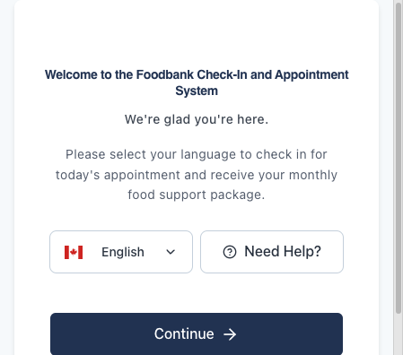
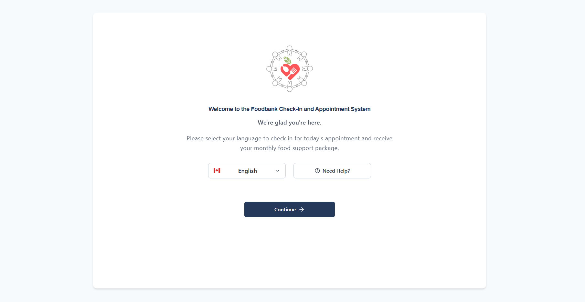
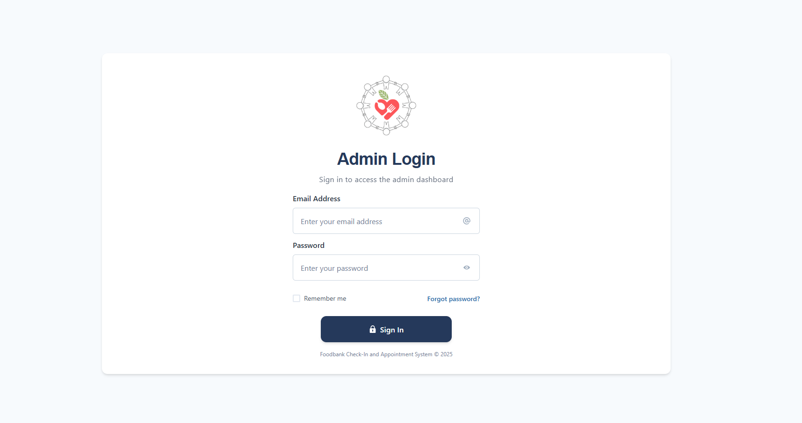
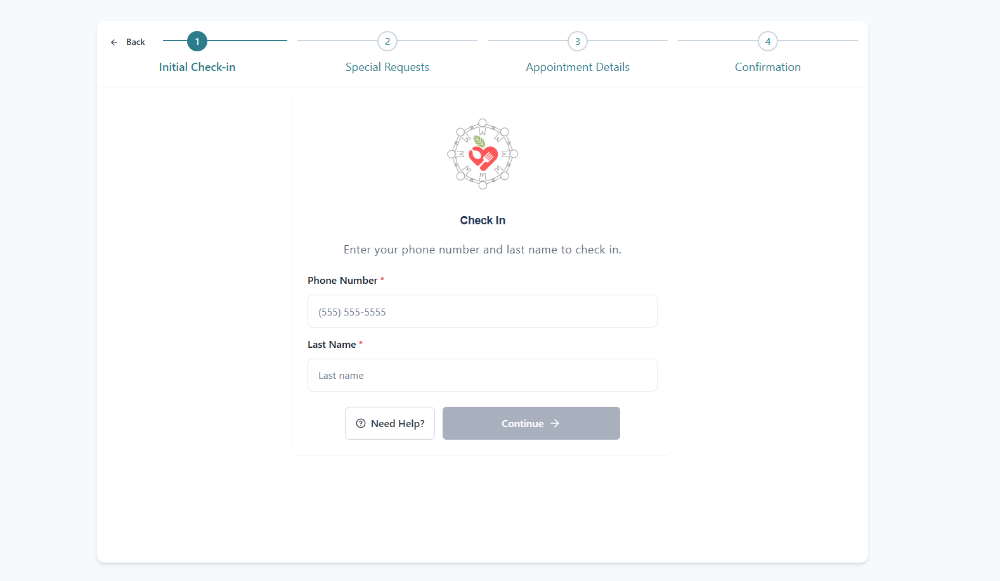
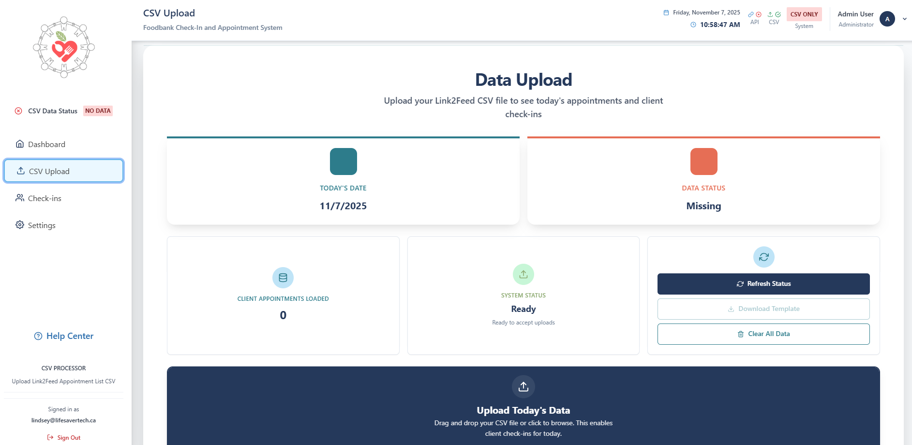
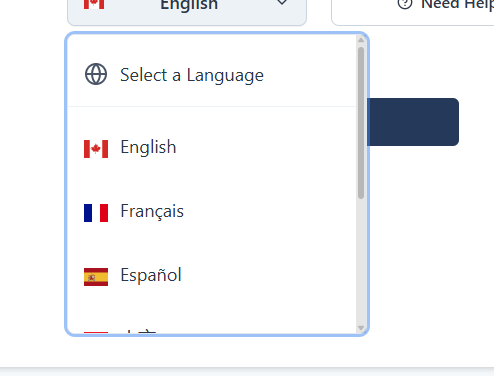
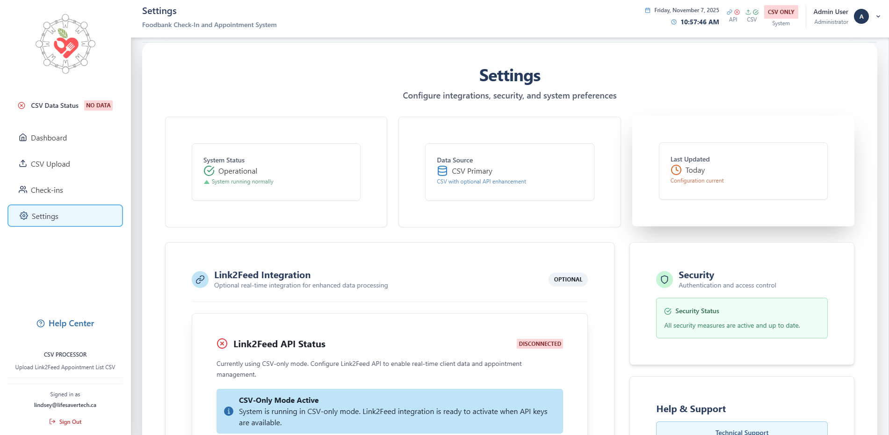
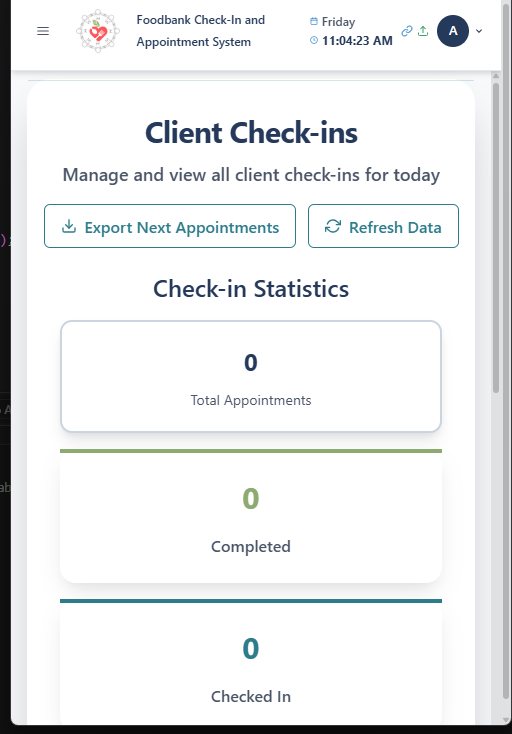
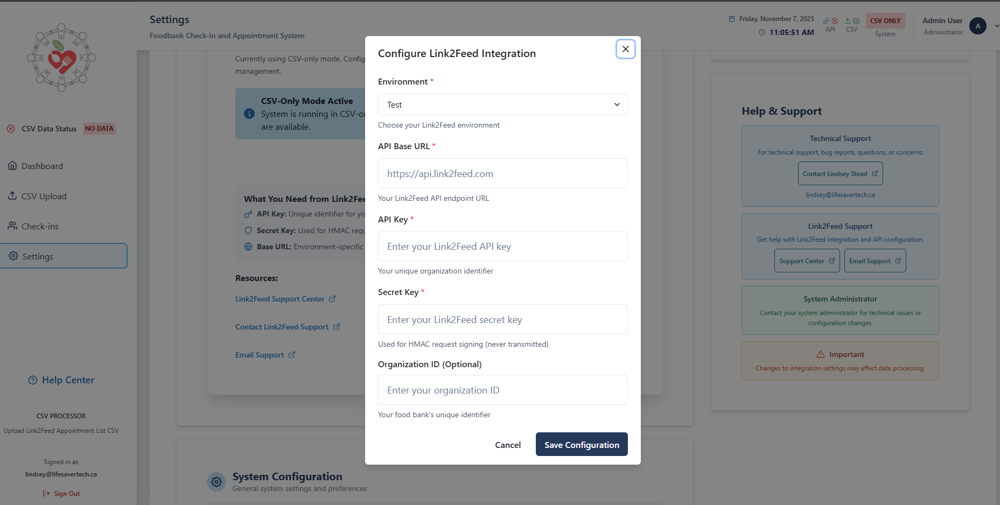
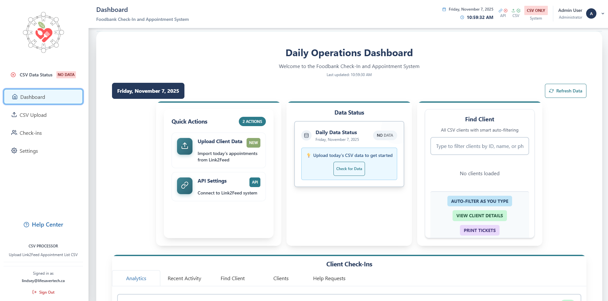

# Foodbank Check-In & Appointment System

Day-of operations software for a not-for-profit food bank: multilingual client kiosk, staff admin, and an Express API over Supabase Postgres with Link2Feed interoperability (CSV primary; optional HMAC-signed API sync).

Built for front-desk use at up to **~130 client check-ins per day**.

This repository is a **public snapshot of the production frontends** (`client/`, `admin/`) plus docs. The Express API, migrations, and secrets stay private.

[](https://www.typescriptlang.org/)
[](https://reactjs.org/)

---

## Try the live demo

| Surface | URL |
|---------|-----|
| **Admin** (staff) | https://foodbank-checkin.vercel.app/login |
| **Kiosk** (clients) | https://foodbank-checkin-tan.vercel.app/ |

Demo login: `admin@example.com` / `testing123`

Day-of appointment rows expire after ~24 hours. If the dashboard looks empty, upload a CSV first (step 2 below).

### Staff flow (admin)

1. **Sign in** at the admin URL with the demo credentials above.
2. **Load today’s appointments** — open **CSV Upload** in the sidebar.
   - Use [`docs/sample-format.csv`](docs/sample-format.csv) as a starting point.
   - **Important:** every `Pick Up Date` must be **today’s date** in the food bank timezone (`America/Vancouver`), e.g. `2026-08-12 @ 9:00 AM`. If the date doesn’t match today, the UI asks you to confirm a mismatch before importing.
   - Expect a success summary (`added` / `duplicates`). Data is listed under Check-ins and on the dashboard.
3. **Work the day** from the sidebar:
   - **Dashboard** — today’s counts and CSV status  
   - **Check-ins** — search, update status, print tickets  
   - **Clients** — profiles linked to visits  
   - **Help Requests** — kiosk assistance queue  
   - **Reports** — metrics / HungerCount-style export  
   - **Settings** — optional Link2Feed API credentials (CSV-only is enough for the demo)
4. **Print a ticket** from a check-in row after a client has checked in (or after you create/update status as staff).

### Client flow (kiosk)

1. Open the kiosk URL (tenant defaults to `cofb`).
2. Pick a language (seven locales: en, fr, es, zh, hi, ar, pa).
3. Enter **phone + last name** matching a row from the CSV you uploaded (example from the sample file: phone `2509134821`, last name `Chen`).
4. Accept privacy consent → optional special requests → review next appointment → confirm.
5. Staff can then find that visit under **Check-ins** and print a ticket.

### Video walkthrough

End-to-end recording (login → CSV → admin tour → kiosk → ticket):

**[Watch / download](https://github.com/lindseystead/foodbank-checkin-system/releases/tag/demo-walkthrough)** (`foodbank-live-demo.webm`)

---

## Purpose

| | |
|--|--|
| **Context** | Not-for-profit food bank front-desk and appointment operations |
| **Capacity** | Designed for up to ~130 check-ins per operating day |
| **Replaces** | Paper day-of lists and ad hoc appointment handling |
| **Integrates with** | Existing Link2Feed exports (and optional Link2Feed API) |

Constraints that shaped the design: PII for a vulnerable population, multi-tenant isolation, large touch targets for kiosk use, seven languages, short retention for day-of appointment payloads, and compatibility with Link2Feed workflows staff already use.

---

## Repository layout

| Path | Role |
|------|------|
| `client/` | Public kiosk (React / Vite / Chakra / i18next) |
| `admin/` | Staff dashboard + volunteer portal |
| `docs/` | Architecture, ops, security, sample CSV |
| `assets/` | Screenshots used in this README |

`admin/src` and `client/src` match the private production frontends. API, migrations, and credentials are **not** in this repo.

---

## Architecture

```
Presentation     client/ (kiosk)  ·  admin/ (staff + volunteer portal)
       ↓
API              Express routes / controllers
       ↓
Domain services  CSV · Link2Feed · tickets · appointment scheduling
       ↓
Data access      unifiedStore adapter  →  tenantStore  →  Supabase Postgres (+ RLS)
```

- Controllers call a stable store API (`unifiedStore`). Persistence moved from in-memory maps to tenant-scoped Postgres without rewriting call sites.
- Day-of appointment rows use ~24h `expires_at` and are purged on an interval.
- **Link2Feed CSV (primary)** and **optional HMAC API sync** both land in the same unified records — see [`docs/link2feed-integration.md`](docs/link2feed-integration.md).

Hosting: Vercel (frontends), Google Cloud Run (API), Supabase (Auth + Postgres).

More detail: [`docs/architecture.md`](docs/architecture.md) · [`docs/link2feed-integration.md`](docs/link2feed-integration.md) · [`docs/data-flow.md`](docs/data-flow.md) · [`docs/ops-notes.md`](docs/ops-notes.md) · [`docs/security-notes.md`](docs/security-notes.md)

---

## Features (short)

**Kiosk** — five-step flow (landing → lookup + consent → special requests → appointment → confirmation), tenant slug routes, help-request modal, 44–48px touch targets.

**Admin** — dashboard, check-ins, clients, help requests, volunteers, reports, CSV upload, settings, volunteer self-service portal. Supabase Auth (PKCE). Roles: director / coordinator / staff vs volunteer.

**CSV** — Link2Feed-style import/export; HungerCount-compatible report export. Sample: [`docs/sample-format.csv`](docs/sample-format.csv).

**Tickets / scheduling** — HTML print tickets; next appointment ~21 days with weekday/holiday rules; staff rebook from admin.

---

## Screenshots



| Kiosk | Admin |
|-------|-------|
|  |  |
|  |  |
|  |  |
|  |  |
| |  |

---

## Stack

| Layer | Technology |
|-------|------------|
| Client | React 18, TypeScript, Vite, Chakra UI, i18next |
| Admin | React 18, TypeScript, Vite, Chakra UI, React Router, Recharts, Supabase Auth |
| API | Node 20, Express 5, TypeScript, Day.js, Helmet, Supabase JS |
| Data | Supabase Postgres + RLS |
| Hosting | Vercel, Cloud Run, Supabase |

---

## Local development

UI only in this repo — point the apps at a running API (or use the live API URL carefully):

```bash
cd client && npm install && npm run dev
# or
cd admin && npm install && npm run dev
```

Optional env:

- Both: `VITE_API_BASE_URL=http://localhost:3001/api`
- Admin: `VITE_SUPABASE_URL`, `VITE_SUPABASE_ANON_KEY`

Quality checks (from each app directory):

```bash
npm run lint
npm run build   # TypeScript + production Vite build
```

See [`docs/engineering-notes.md`](docs/engineering-notes.md) for where key frontend modules live.

---

## License

Proprietary — All Rights Reserved. See [LICENSE](LICENSE).  
Copyright © Lifesaver Technology Services Inc. Backend services are not included in this repository.
